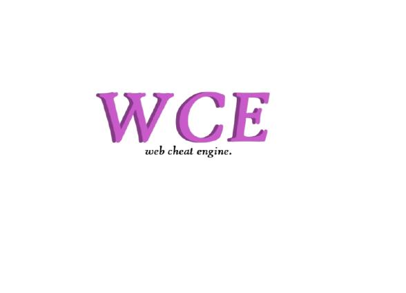

# WCE-Web-Cheat-Engine

This project is a web-based cheat engine designed for educational experimentation with browser-side value manipulation and debugging. It allows users to inspect and modify in-memory values, test scripts, and explore how game or web app data can be changed in a controlled environment. It is intended for learning and research purposes.
WCE is a lightweight browser-based tool for experimenting with web page behavior in real time. It helps users inspect and modify values, test custom scripts, and understand how client-side code interacts with the page during runtime.

This project is intended for learning, debugging, and prototyping in web environments, giving users a simple way to explore and manipulate page data without needing a full development setup.

Features include:
- Inspecting page elements and runtime values
- Modifying data during live sessions
- Testing custom scripts and quick web experiments
- A straightforward interface for browser-based debugging

Use responsibly and only in environments where you have permission to test or modify the content.

